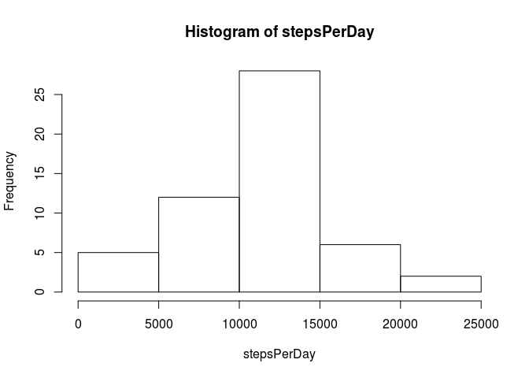

# Reproducible Research: Peer Assessment 1


## Loading and preprocessing the data

First we need to read in our data set. As the data is a zipped csv, we need to unzip and read it via the _read.csv_-funtction as follows:


```r
data <- read.csv(unz("activity.zip", "activity.csv"))
```

A first look into the data shows its structure.


```r
head(data)
```

```
##   steps       date interval
## 1    NA 2012-10-01        0
## 2    NA 2012-10-01        5
## 3    NA 2012-10-01       10
## 4    NA 2012-10-01       15
## 5    NA 2012-10-01       20
## 6    NA 2012-10-01       25
```

## What is mean total number of steps taken per day?

With the data read in we are now able to provide some insights. Let's start by creating a histogram that shows the steps taken each day.


```r
stepsPerDay <- tapply(data$steps, data$date, sum)
hist(stepsPerDay)
```



We then calculate the mean and median of the steps taken per day.


```r
mean(stepsPerDay, na.rm = TRUE)
```

```
## [1] 10766.19
```


```r
median(stepsPerDay, na.rm = TRUE)
```

```
## [1] 10765
```

Mean and median are very similar.

## What is the average daily activity pattern?

To provide insights into the daily activity pattern we need to first split the data set by the 5-min time intervals. We then create a new data frame that contains the intervals next to the average steps taken per interval. The new data frame makes it easy to provide a time series plot of this data.


```r
avgStepsPerInterval <- tapply(data$steps, data$interval, mean, na.rm = TRUE)
intervalData <- data.frame(interval = unique(data$interval), avgSteps = avgStepsPerInterval)
plot(intervalData, type = "l", xlab = "Interval", ylab = "Avg Steps")
```


The person who provided the data seems to be very active in the morning hours. His or her most active time interval is the following:


```r
maxIndex <- which.max(intervalData$avgSteps)
intervalData[maxIndex, ]
```

```
##     interval avgSteps
## 835      835 206.1698
```


## Imputing missing values

Let's check which columns contain __NA__ values:


```r
sum(is.na(data$date))
```

```
## [1] 0
```

```r
sum(is.na(data$interval))
```

```
## [1] 0
```

```r
sum(is.na(data$steps))
```

```
## [1] 2304
```

We clearly see, that only the steps-column contains missing values. This also answers the question, how many rows with __NA__s are in the data set. 

That only one column has missing values makes it a lot easier to replace the values. First we need a strategy to fill in new values. As we've already calculated the average steps for each interval, we will take this information to clean up the data set:


```r
missingIntervals <- data$interval[is.na(data$steps)]
stepPolyfill <- sapply(missingIntervals, function(iv) { 
  point <- intervalData[intervalData$interval == iv,]
  point$avgSteps
})
```

Now that we have our missing steps, we can create a new data set without __NA__ values.


```r
dataWithoutNa <- data
dataWithoutNa$steps[is.na(dataWithoutNa$steps)] <- stepPolyfill
```

Let's recreate the histogram that shows the steps per day to see, if there is a difference based on our changed data.


```r
stepsPerDayNa <- tapply(dataWithoutNa$steps, dataWithoutNa$date, sum)
hist(stepsPerDayNa)
```


```r
mean(stepsPerDayNa, na.rm = TRUE)
```

```
## [1] 10766.19
```


```r
median(stepsPerDayNa, na.rm = TRUE)
```

```
## [1] 10766.19
```

Compared with the data set, that contains __NA__-values there is almost no difference: The mean is equal, there is only a small difference regarding the median and the histograms show the same patterns (with slight differences in the frequency).

## Are there differences in activity patterns between weekdays and weekends?

First we'll create a factor variable _days_ that consists of two levels: _weekday_ and _weekend_. We create a function that checks if a day is a weekday or a weekend and returns the right level.


```r
days <- factor(c("weekday", "weekend"))
whichDay <- function(dateAsStr) {
  day <- weekdays(as.POSIXlt(dateAsStr))
  if(day == "Samstag" | day == "Sonntag") {
    "weekend"
  } else {
    "weekday"
  }
}
```

Next, let's split the data by these two levels. Therefore, we will add an additional column to our data set.


```r
data$days <- sapply(data$date, whichDay)
weekdays <- data[data$days == "weekday", ]
weekend <- data[data$days == "weekend", ]
```

Now are we able to calculate the mean steps per interval for weekends and weekdays.


```r
avgStepsPerIntervalWd <- tapply(weekdays$steps, weekdays$interval, mean, na.rm = TRUE)
intervalDataWd <- data.frame(interval = unique(weekdays$interval), avgSteps = avgStepsPerIntervalWd)

avgStepsPerIntervalWe <- tapply(weekend$steps, weekend$interval, mean, na.rm = TRUE)
intervalDataWe <- data.frame(interval = unique(weekend$interval), avgSteps = avgStepsPerIntervalWe)
```

Finally we create a nice plot for weekdays and weekends.


```r
par(mfrow=c(2,1))
plot(intervalDataWd, type = "l", xlab = "", ylab = "Avg Steps", main = "Weekdays")
plot(intervalDataWe, type = "l", xlab = "Interval", ylab = "Avg Steps", main = "Weekends")
```


The comparison clearly shows that there is a difference in the activity patterns. The person who provided the data is much more active on weekend. His or her acitivity is divided over the whole day on weekends.
